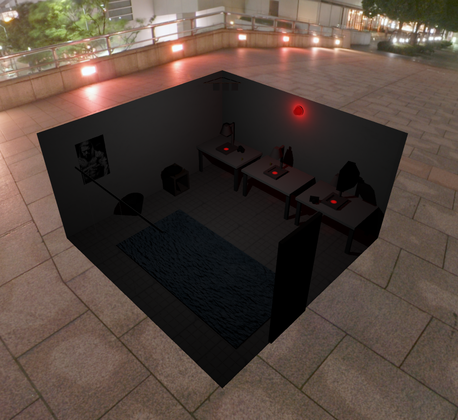
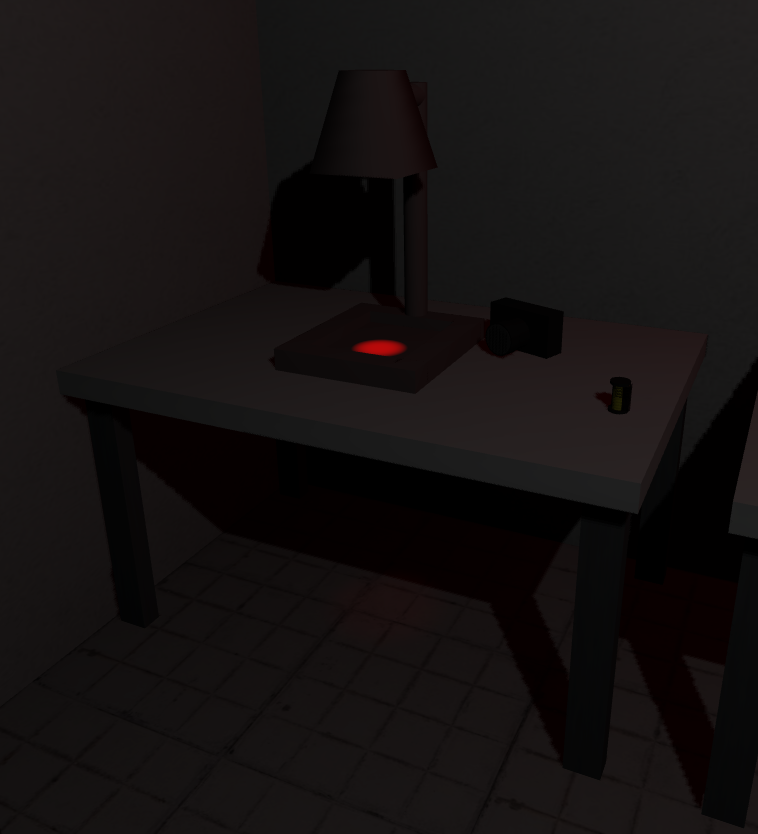
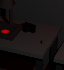
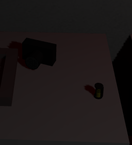
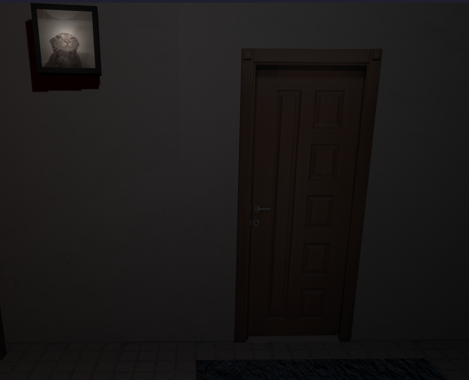
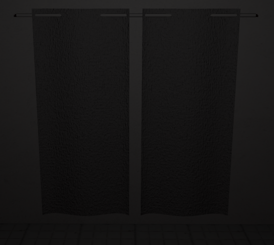
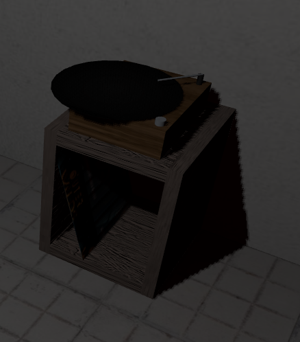
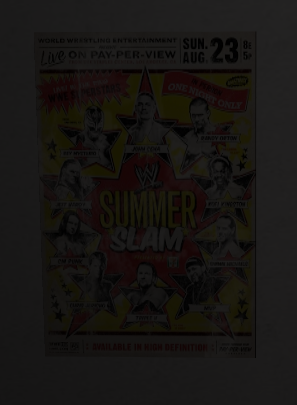
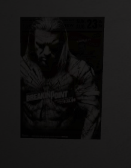

# SGI 2023/2024

## Group T0xG0y
| Name             | Number    | E-Mail             |
| ---------------- | --------- | ------------------ |
| António Santos         | 202008004 | up202008004@up.pt                |
| Pedro Silva         | 202004653 | up202004985@up.pt                |

----

## Projects

### [TP1 - ThreeJS Basics](tp1)

- Portal 1 cake room inspired scene

-----

### [TP2 - Darkroom](tp2)

- The scene features a darkroom, a room used for developing camera rolls, with several additional elements in order to populate and meet the projects requirements.

- Strengths
  - Captured the intended atmosphere, of a cozy yet neutral room with some lived in aspects.
  - General creativity with the different tools that are implemented.

- Problems
  - Lack of a well defined data structure, with the necessary adaptations for threejs .
  - Parser was limiting, especially coming from the first project which had allowed for a greater deal of freedom with threejs's tools even if limited by time, requirements and lack of experience.

- Screenshots
  - Darkroom
  
  - Table featuring several items using the implemented primitives and lights (cylinder, box, nurb, spotlight, ...)
  
  - Camera and camera roll using LODs (a lens appears on camera and a more detailed camera roll) 
  
  
  - A wall mounted CRT TV (playing a video) and a door
  
  - Nurb curtains with a bump texture
  
  - Vinyl player using bump textures, buffer geometry (vinyl) and nurbs (vinyl sleeve)
  
  - Shifting poster's content with mipmaps (may not always be the intended usage of mipmaps but a good visualization of the effect)
  
  

----

### [TP3 - ...](tp3)
- (items briefly describing main strong points)

