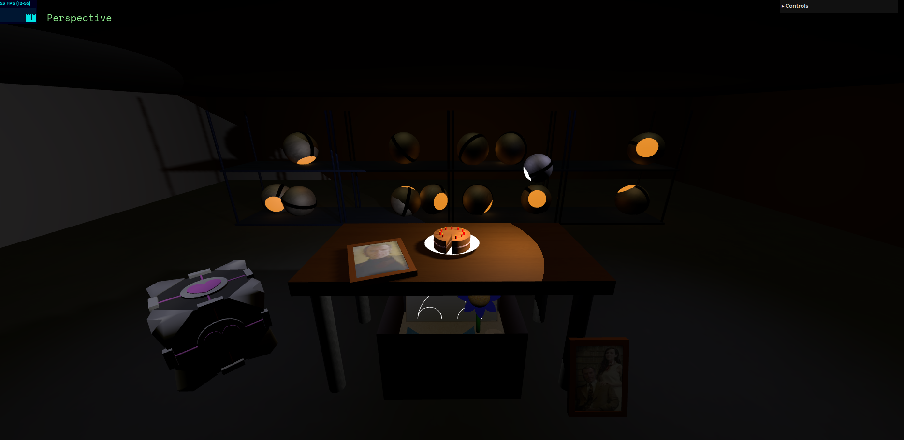
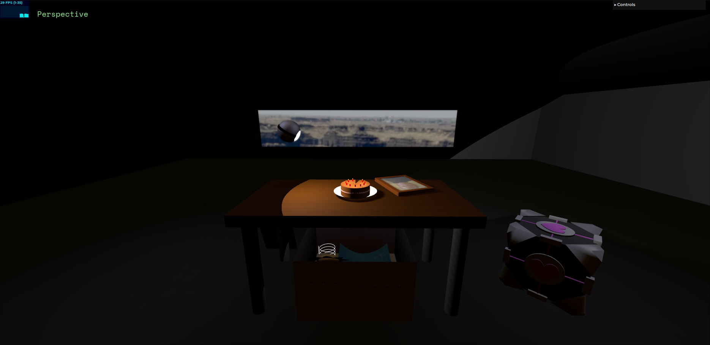

# SGI 2023/2024 - TP1

## Group: T04G05

| Name           | Number    | E-Mail                   |
| -------------- | --------- | ------------------------ |
| António Santos | 202008004 | up202008004@edu.fe.up.pt |
| Pedro Silva    | 202004985 | up202004985@edu.fe.up.pt |

---

## Project information

In this project, we decided to deviate a bit from the proposed scene and created our own recreation of the "cake room" from the videogame "Portal", while implementing all mandatory elements. We put our creativity to the test, as we tried to apply our knowledge from the practical class exercises in different aspects of our scene, staying true to its theme. The end result is a truly atmospheric room, with a lot of attention to detail and complex objects related to the videogame that served as inspiration (the Companion Cube, the Personality cores...).

### Scene overview

The scene contains a wide **room**, with a **table** in its center. On top of that table is a **cake** with **candles** placed on it and a **picture frame** of a man named "Cave Johnson". Leaning towards one of the table's legs is another picture frame of Cave Johnson with his assistant. Next to the table is a **companion cube**, and under the table is a **box** full of mysterious items: a **painting** of a car, a **blueprint**, a **spring**, a **jar** and a **flower**. Above the table looms a **floating light** source pointing towards the cake. Behind the table, a **shelf** full of lit **personality cores** is present.

Turning around, a very wide glass pane **window** is displayed, revealing a beautiful landscape. While not totally transparent, it lets all of the light from the directional light shine through, even though its intensity is not significant.

---

## Issues/Problems

-   Performance is definitely something that could be improved. Fog is toggleable in the GUI, but more work could have been done, for example, by preloading textures and toggling shadows.
-   The structure of the code is not perfect. Some parts are a bit all over the place and certain repeated procedures could have been simplified in methods.
