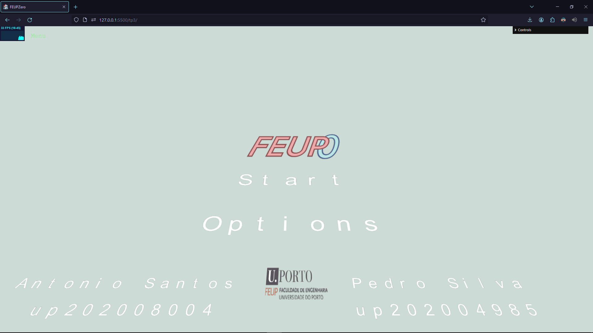
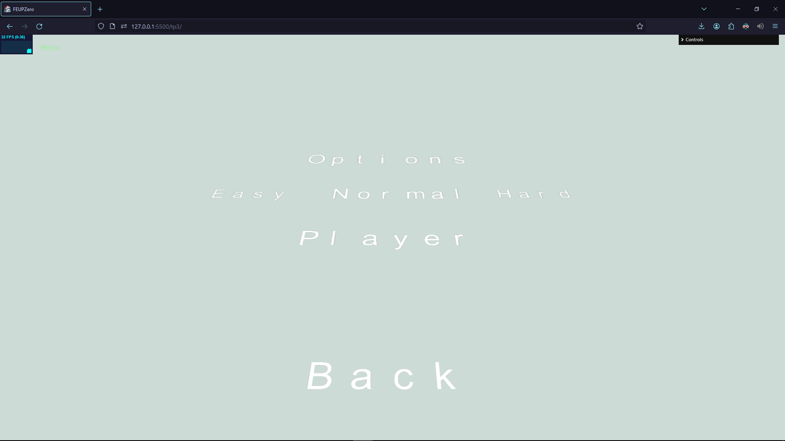
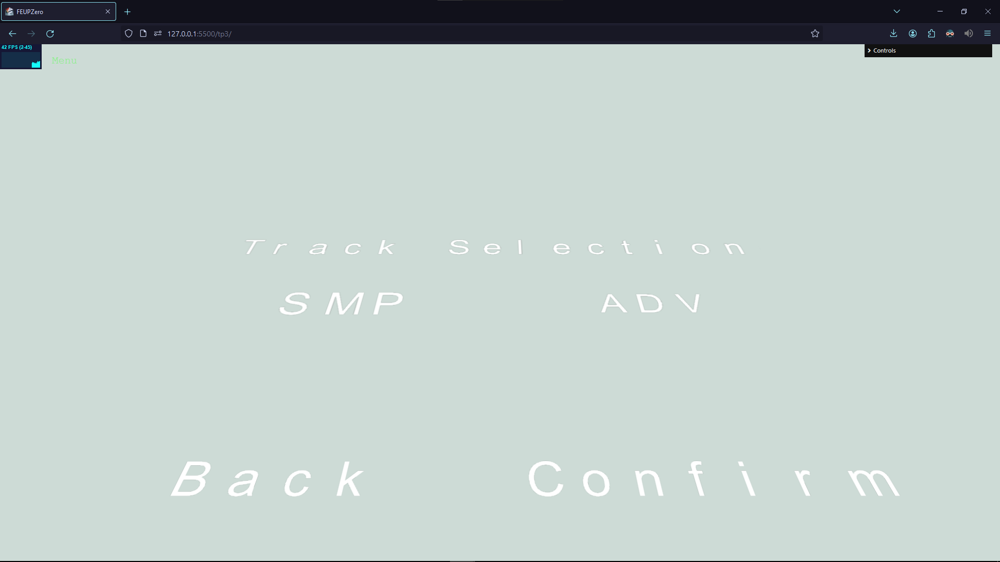
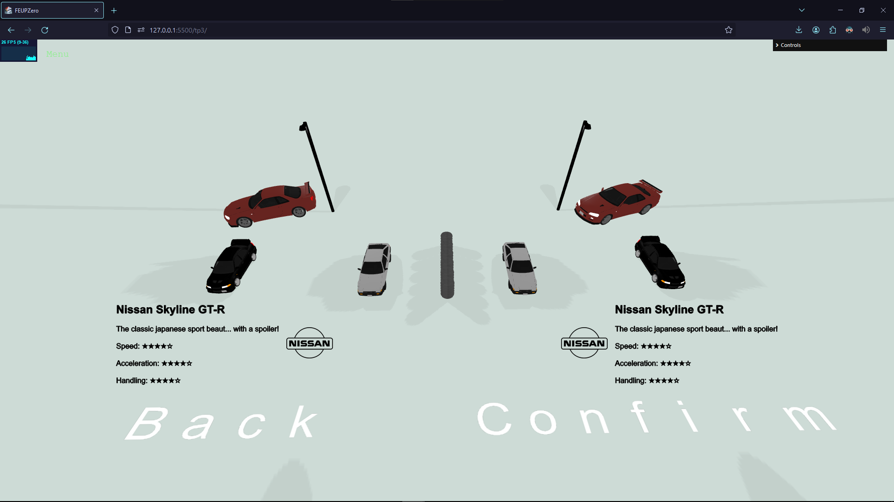
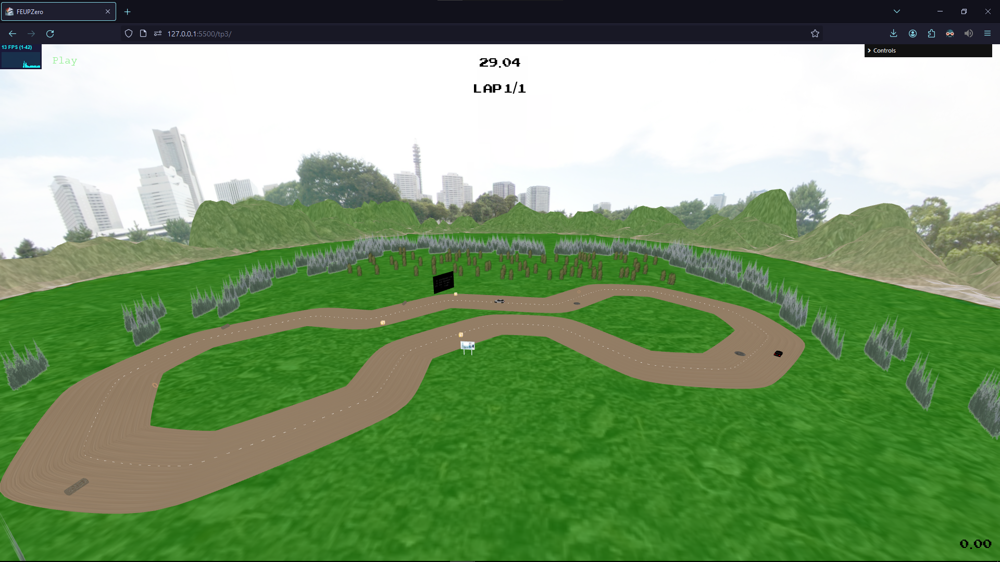
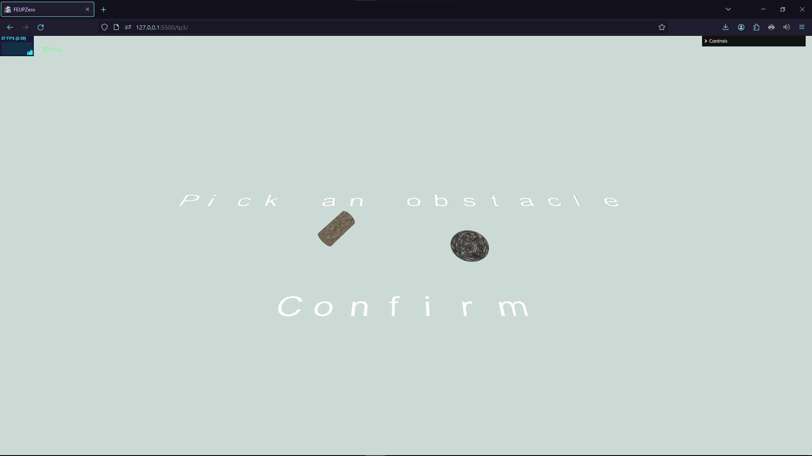
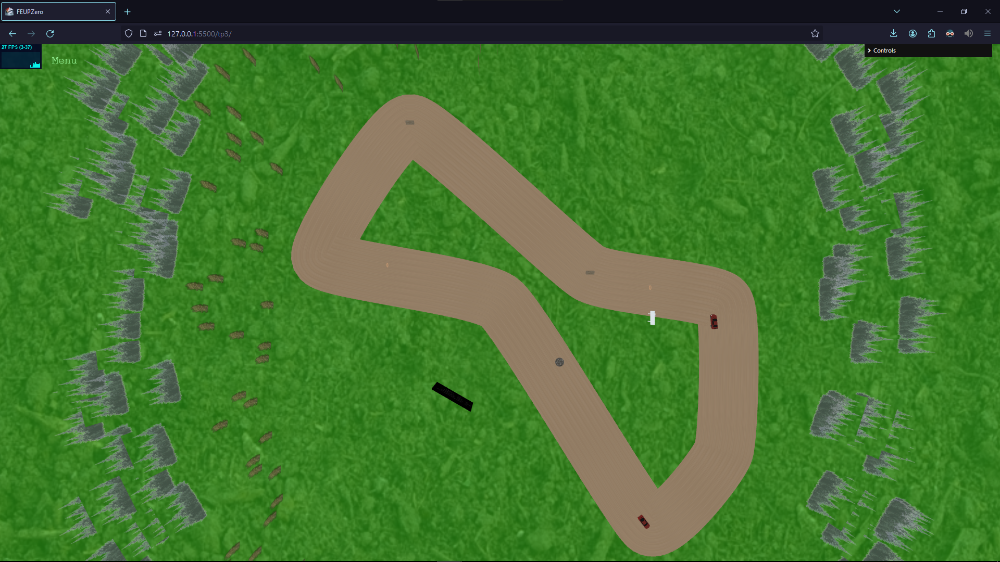
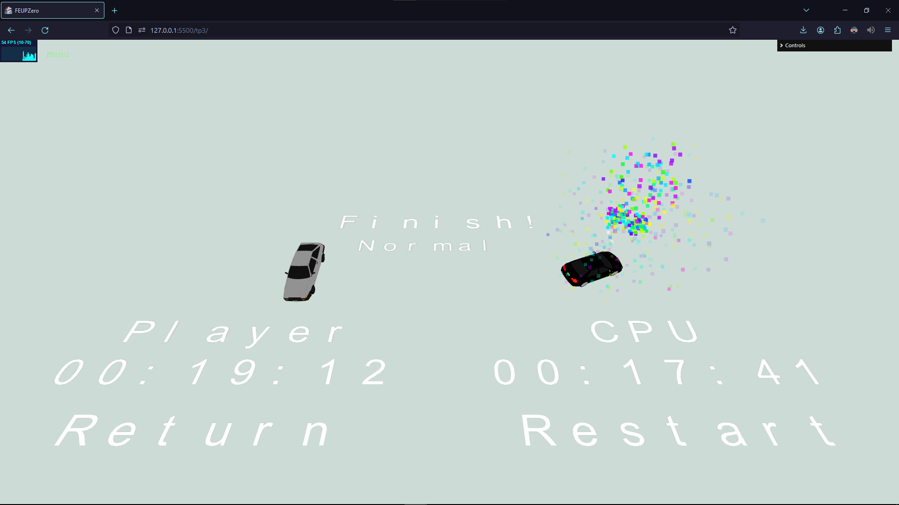

# SGI 2023/2024 - TP3

## Group: T04G05

| Name     | Number    | E-Mail |
| -------- | --------- | ------ |
| António Santos | 202008004 | up202008004@up.pt    |
| Pedro Silva | 202004985 | up202004985@up.pt    |

---

## Project information

- A simple yet fun PSX rally inspired game, featuring 3 different cars and 2 tracks, played against an autonomous ghost-like CPU.
  - The game features several screens documented below, links to their relevant files are also provided:
    - [**Main Menu**](./custom/MainMenu.js) - with selectable Start and Options buttons.
    

    - [**Options**](./custom/Options.js) - allows changes of the player's name and difficulty settings of the game.
    

    - [**Track Selection**](./custom/TrackSelection.js) - selection of the track to be raced, *SMP*, a simpler shorter track, or *ADV*, a longer track (the names are a nod to early 2000's arcade racing games track selection screens).
    

    - [**Car Selection**](./custom/CarSelection.js) - menu featuring the 3 different cars choosable by the user, each with a unique model and stats, alongside a fitting description.
    

    - **Tracks** - both tracks feature: an informative display that shows the elapsed time, player lap count, pickup timer and speed value; a bas-relief "promotional display"; "billboarding" trees (closer to the track) and static forests; obstacles and powerups.
      - [**SMP**](./scenes/feupzero/SMP.xml)
      

      - [**ADV**](./scenes/feupzero/ADV.xml)
      

    - [**Obstacle Selection**](./custom/ObstaclesScreen.js) - on hitting a powerup, in addition to granting the powerup's effect the player must place an obstacle on the track. Upon picking their preferred obstacle the player is shown the track and is able to place it.
    
    

    - [**Pause Menu**](./custom/PausedScreen.js) - menu allowing the player to return to title or continue the ongoing race.
    

    - [**End Game**](./custom/EndScreen.js) - screen shown upon race completion showing the winner's car in a flare of fireworks, times for both the CPU and player and options to restart the same race or return to title.
    

  - The game also features several other effects such as:
    - Button responsiveness - on hover buttons increase in size and selected options are highlighted in a larger size.
    - Post processing - in order to give the game the intended PSX look and feel we implemented a pixelation post processing effect;
    - Environment - in order to bring tracks to life a shader is used to create terrain around the track, furthermore trees and forests billboards are used to convey the aesthetic of PSX games.
    - Car models - following up on the previous idea, we also elected to use car models that were simple and lightweight, in order to not only keep with the aesthetic but also not hinder performance. [[source]](https://sketchfab.com/LePointBAT)
    - Particle system - a simple particle system was also implemented for the end screen fireworks.
    - Obstacles animations;

- We are very proud of the work developed in this project and believe that it stands as a good application of the knowledge gathered throughout the semester into a fun interactive and interesting final product that meets almost all of the criteria set out in the beginning.

---

## Issues/Problems

- There are some missing features and issues that whilst we would've liked to work on weren't implemented, either/or due to time constraints or performance concerns:
  - Texture updating on the outdoors display drastically lowers the framerate, we tried to address this issue but ran into several issues and unfortunately ran out of time to improve this issue.
  - The bas-relief display does not feature a recurringly updating image of the current camera, due to framerate concerns. While we did investigate a possible solution for this issue using a WebGLRenderTarget alongside a DepthTexture and rendering the scene twice, once for the user's display and once to this target, we weren't successful in recreating the intended effect.
