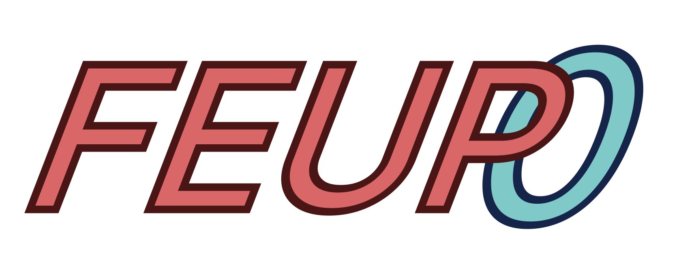

## User Manual

A simple yet fun PSX rally inspired game.

### Running

Run a web server on the project folder.

### Menus

The following sections will highlight how to navigate the game's menus.

#### Main Menu
You are able to start a game by pressing **Start** and access the options menu by pressing **Options**.

#### Options Menu
Difficulty can be changed by pressing one of the 3 buttons, **Easy**, **Normal** (default), **Hard** and the player's name can be changed by clicking on the currently selected name and typing it in. Changing the difficulty increases the speed of the CPU car. 

#### Track Selection
There are 2 available tracks, **SMP**, a simpler shorter track, or **ADV**, a longer track. **Confirm** moves onto the next step while **Back** returns to the **Main Menu**.

#### Car Selection
You are able to select 1 of 3 different cars, each with a different set of stats (top speed, acceleration and turning speed) illustrated by the on screen descriptions. **Back** returns you to track selection and **Confirm** starts the race.

#### Obstacle Selection
Upon colliding with a powerup (see [Powerups](#powerups)) you are able to select one of 2 obstacles (see [Obstacles](#obstacles)) and are then shown a map of the track you are racing on where you'll be able to click on any part of it, placing the obstacle and returning to the race with your active powerup.

#### Pause Menu
When pausing the game you'll be able to opt between unpausing, and continuing your race (**Continue**), restarting the current race (**Restart**) and returning to the title screen (**Exit**).

#### End Game
When a race ends you are prompted to either return to the title screen via the **Return** button or replay the race with the same conditions, via **Restart**.

### Playing

#### Controls
- **W** - Accelerate
- **S** - Break
- **A** - Turn left
- **D** - Turn right
- **P** - Pause
- **Spacebar** - Lock/Unlock the camera to/from the car
- **Mouse 1** - Place an obstacle (when prompted)

#### Obstacles
There are 2 obstacles in the game:
- **Spin** - an oil puddle and will make your car spin uncontrollably.
- **Speed Down** - a trunk that limits your top speed.

#### Powerups
There are 2 powerups in the game:
- **Handling Boost** - a steering wheel that increases your "handling" (aka turning speed).
- **Speed Boost** - a box that increases your car's top speed.